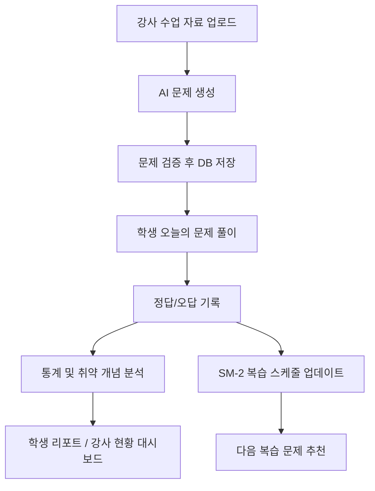

# 3분코딩

> AI 기반 학원생 맞춤형 복습 웹앱  
> KEG 바이브코딩 콘테스트 출품작

## 소개

3분코딩은 코딩 학원 수업 직후의 복습 공백을 줄이기 위해 만든 AI 기반 교육 솔루션입니다.
강사가 업로드한 수업 자료를 바탕으로 AI가 복습 문제를 자동 생성하고, 학생의 정답률과 오답 패턴을 분석해 개인 맞춤형 복습 경험을 제공합니다.

이 프로젝트는 단순 LMS가 아니라, 교육 현장에서 실제로 자주 발생하는 아래 문제를 해결하는 데 초점을 맞췄습니다.

- 수강생 수준 편차가 커서 한 번의 수업으로 모두를 따라오게 만들기 어렵다.
- 학생은 혼자 복습할 때 무엇을 다시 봐야 하는지 알기 어렵다.
- 강사는 학생들이 주로 어떤 개념에서 막히는지 빠르게 파악하기 어렵고, 수준 편차가 큰 반에서 어떤 속도로 진도를 나가야 할지 판단하기 어렵다.

## 해결하려는 문제

### 학생 관점

- 수업 직후 복습 흐름이 끊기기 쉽다.
- 혼자 예습·복습하는 방법을 모르는 경우가 많다.
- 어떤 개념이 약한지 데이터로 확인하기 어렵다.
- 코딩 문제를 풀어도 바로 실행해 보거나 피드백을 받기 어렵다.

### 강사 관점

- 학생들이 어떤 개념에서 반복적으로 막히는지 수업 중에는 직관적으로만 느끼고, 데이터로 확인하기 어렵다.
- 수준 편차가 큰 반에서 어느 지점까지 설명을 반복하고, 어디서부터 다음 진도로 넘어가야 할지 판단하기 어렵다.
- 수업 시간 안에 모든 학생을 개별적으로 챙기기 어렵기 때문에, 수업 밖에서 학생이 스스로 예습·복습할 수 있는 장치가 필요하다.

## 핵심 가치

- 학생은 하루 3분 안에 오늘 배운 내용을 다시 떠올릴 수 있습니다.
- 강사는 학생별 이해도와 취약 개념을 통계로 확인하고, 더 근거 있게 수업 흐름을 조정할 수 있습니다.
- 시스템은 학생의 오답과 복습 이력을 누적해 다음 학습 경험을 더 똑똑하게 만듭니다.

## 주요 기능

### 학생 기능

- 오늘의 문제 조회
- 개념 문제, 코딩 문제 풀이
- 코드 실행 및 테스트케이스 검증
- 1차 오답 시 힌트 제공, 2차 오답 시 해설 제공
- SM-2 기반 반복 복습 스케줄
- 취약 개념, 정답률, 스트릭, 복습 예정 문제 통계 확인
- 주간/월간 AI 취약점 리포트 확인
- PWA 설치 및 푸시 알림 구독

### 강사 기능

- 과목 생성 및 수업 자료 업로드
- 업로드한 수업 자료 기반 AI 문제 자동 생성
- 학생별 학습 현황 확인
- 문제 목록 및 생성 결과 확인

### AI 기능

- 수업 자료 기반 복습 문제 생성
- 문제별 힌트, 해설, 테스트케이스, 개념 태그 생성
- 오답 패턴 기반 취약점 리포트 생성
- 저장된 해설 우선 사용, 필요 시 AI 보강

## 왜 이 프로젝트가 LMS가 아닌가

3분코딩은 수업 자료를 저장하고 전달하는 데서 끝나지 않습니다.
핵심은 이미 존재하는 수업 자료를 AI가 다시 학습 콘텐츠로 재구성하고, 학생의 실제 풀이 데이터를 바탕으로 복습 경험을 개인화한다는 점입니다.

즉, 이 프로젝트는 "자료 보관 플랫폼"이 아니라 아래 학습 루프를 자동화하는 시스템입니다.

1. 강사가 수업 자료를 올린다.
2. AI가 복습 문제를 만든다.
3. 학생이 문제를 푼다.
4. 시스템이 정오 여부와 취약 개념을 기록한다.
5. 학생은 필요한 시점에 다시 복습한다.

## 서비스 흐름



## AI 활용 전략

### 개발 단계

- Claude Code
  - 메인 구현 에이전트
  - API 설계, Supabase 연동, 인증/권한 처리, 복습 로직 구현 담당
- Codex
  - 독립 리뷰 에이전트
  - 권한 경계, 타입 안정성, 통계 정합성, lint/typecheck, 예외 케이스 점검 담당

### 서비스 단계

- `gpt-4o`
  - 수업 자료 기반 문제 생성
  - 정답, 힌트, 해설, 테스트케이스, 개념 태그 생성
- `gpt-4o-mini`
  - 취약점 리포트 생성
  - 저장된 해설이 부족할 때만 설명 보강

### 비용과 효율을 위한 원칙

- AI는 문제 생성과 설명 보강처럼 가치가 큰 구간에만 사용합니다.
- 정답 판별, 권한 검증, 복습 스케줄 계산, 통계 집계는 서버 로직으로 처리합니다.
- 문제 생성 결과는 JSON 구조 검증과 품질 검증을 통과한 뒤에만 저장합니다.
- 해설은 DB에 저장된 기본 해설을 우선 사용하고, 필요한 경우에만 AI를 호출합니다.

## 기술 스택

| 영역              | 기술                                 |
| ----------------- | ------------------------------------ |
| Frontend          | Next.js 16, React 19, Tailwind CSS 4 |
| Backend           | Next.js App Router API Routes        |
| Auth              | NextAuth Credentials                 |
| Database          | Supabase                             |
| AI                | OpenAI API (`gpt-4o`, `gpt-4o-mini`) |
| Code Execution    | Judge0 CE                            |
| PWA               | `@ducanh2912/next-pwa`               |
| Push Notification | Web Push, VAPID, Vercel Cron         |
| Language          | TypeScript                           |

## 아키텍처 포인트

- 학생/강사 역할 분리
- API 단 권한 검사
- Supabase Service Role을 사용하는 서버 측 검증
- 문제 생성과 일반 비즈니스 로직 분리
- SM-2 기반 반복 복습 스케줄링
- PWA + 푸시 알림으로 짧은 복습 루프 강화

## 구현 범위

현재 저장소 기준으로 아래 흐름이 구현되어 있습니다.

- 회원가입 / 로그인
- 학생 / 강사 역할 분기
- 과목 조회 및 수강 등록
- 수업 자료 업로드
- AI 문제 생성
- 오늘의 문제 / 일일 문제 조합
- 답안 제출 및 정답 판별
- 코딩 문제 실행
- 복습 문제 조회 및 제출
- 취약점 리포트 생성
- 학생 통계 페이지
- 강사 학생 현황 페이지
- PWA 설치 및 푸시 알림

자세한 API는 [API_SPEC.md](./API_SPEC.md)에서 확인할 수 있습니다.

## 프로젝트 구조

```text
app/
  admin/                     강사용 화면
  dashboard/                 학생용 화면
  questions/                 문제 풀이 / 결과 화면
  subjects/                  과목 / 수업 화면
  api/                       API Routes
    answers/                 답안 제출 및 조회
    daily-questions/         오늘의 문제 조합
    execute/                 코드 실행
    explanation/             해설 제공
    questions/               문제 조회 및 생성
    reports/                 취약점 리포트
    reviews/                 복습 조회 및 제출
    stats/                   학습 통계
    cron/daily-notify/       일일 푸시 알림
components/                  공통 UI 컴포넌트
lib/                         인증, SM-2, OpenAI, Supabase, Push 유틸
docs/                        리포트 초안, 체크리스트, 참고 문서
supabase/                    DB 관련 파일
public/                      PWA manifest, icons, service worker
```

## 화면 및 데모

- 라이브 URL: [https://3min-coding.vercel.app/](https://3min-coding.vercel.app/)
- GitHub 저장소: [https://github.com/Jkim7981/3min-coding](https://github.com/Jkim7981/3min-coding)

## 로컬 실행 방법

### 1. 의존성 설치

```bash
npm install
```

### 2. 환경 변수 설정

프로젝트 루트에 `.env.local` 파일을 만들고 아래 값을 채워주세요.

```bash
OPENAI_API_KEY=
SUPABASE_SERVICE_ROLE_KEY=
NEXT_PUBLIC_SUPABASE_URL=
NEXT_PUBLIC_SUPABASE_ANON_KEY=
NEXTAUTH_SECRET=
CRON_SECRET=
NEXT_PUBLIC_VAPID_PUBLIC_KEY=
VAPID_PRIVATE_KEY=
VAPID_MAILTO=
```

### 3. 개발 서버 실행

```bash
npm run dev
```

브라우저에서 `http://localhost:3000`으로 접속합니다.

## 스크립트

```bash
npm run dev
npm run build
npm run start
npm run lint
```

## 주요 API 예시

### 강사

- `POST /api/subjects`
- `POST /api/sessions`
- `POST /api/questions`
- `GET /api/admin/students`

### 학생

- `GET /api/questions?subject_id=...`
- `GET /api/daily-questions`
- `POST /api/answers`
- `POST /api/reviews`
- `GET /api/stats`
- `POST /api/reports`

### 부가 기능

- `POST /api/execute`
- `POST /api/explanation`
- `POST /api/push/subscribe`
- `GET /api/cron/daily-notify`

더 자세한 요청/응답 스펙은 [API_SPEC.md](./API_SPEC.md)를 참고해주세요.

## 실무형 설계 포인트

이 프로젝트는 공모전 데모용 기능 나열이 아니라, 실제 교육 현장 적용 가능성을 고려해 아래 원칙으로 설계했습니다.

- AI가 만든 결과를 그대로 신뢰하지 않고 서버에서 검증
- 학생 답안과 통계 데이터는 DB에 누적해 재사용
- 반복 복습은 SM-2 알고리즘 기반으로 자동화
- 강사와 학생 모두에게 데이터 기반 피드백 제공
- 비용이 큰 AI 호출은 최소화하고 캐시 가능한 구조로 설계

## 문서

- [API 명세서](./API_SPEC.md)
- [AI 빌딩 리포트 초안](./docs/ai-building-report-draft.md)
- [제출 체크리스트](./docs/submission-checklist.md)
- [CLAUDE.md](./CLAUDE.md)

## 향후 개선 아이디어

- 과목별 초대 코드(`join_code`) 기반 수강 등록
- 해설 공개 조건 강화
- 과목별 복습 통계 정합성 개선
- 문제 승인 플로우 추가
- 강사용 학생 위험도 분석

## 팀 메모

공모전 제출 시 아래 항목을 함께 준비해야 합니다.

- Public GitHub 저장소 URL
- 배포 URL
- AI 빌딩 리포트 PDF
- 개인정보 수집/이용 동의서 및 참가 각서 PDF

## 한 줄 요약

3분코딩은 학원 수업 자료를 AI가 복습 콘텐츠로 재구성하고, 학생별 학습 데이터를 바탕으로 반복 복습을 개인화하는 AI 기반 차세대 교육 솔루션입니다.
